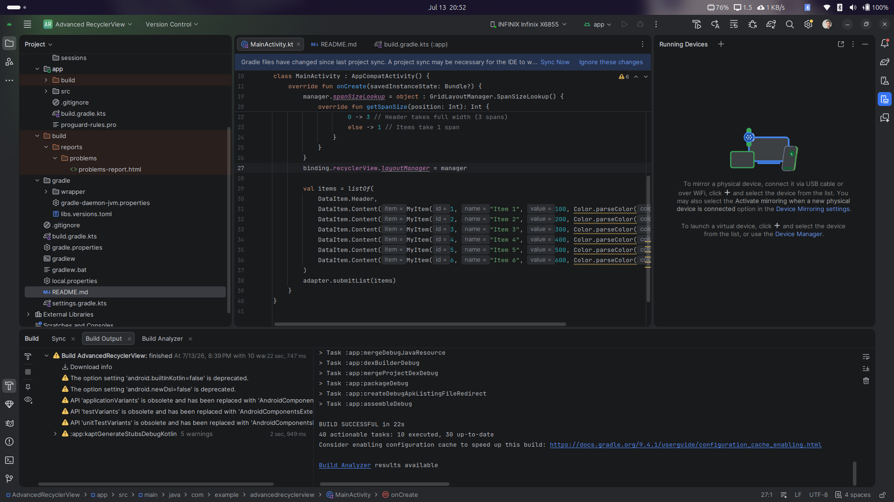
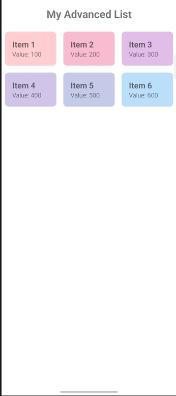

# Tugas 10: Advanced RecyclerView Use Cases

## Identitas Mahasiswa
* **Nama:** Shahan Syah Naufal Abdullah
* **NIM:** 452024611028
* **Kelas:** Pemrograman Aplikasi Mobile / Android

---

## 📸 Dokumentasi Aplikasi (Screenshots / GIF)

---

## 📘 Penjelasan Teori: Efisiensi `ListAdapter` vs `RecyclerView.Adapter` Standar

Dalam proyek ini, komponen daftar data telah ditingkatkan performanya menggunakan **ListAdapter** dan **DiffUtil**. Berikut adalah analisis perbedaan efisiensi manipulasi data di antara keduanya berdasarkan jumlah tindakan kalkulasi:

### 1. RecyclerView.Adapter Standar (Costly & Wasteful)
* **Mekanisme:** Menggunakan pendekatan manual yang biasanya bergantung pada pemanggilan fungsi `notifyDataSetChanged()`.
* **Efisiensi:** Saat terjadi perubahan data (meskipun hanya satu elemen yang berubah), `notifyDataSetChanged()` memaksa RecyclerView untuk menggambar ulang (re-bind dan re-create jika diperlukan) **seluruh item** yang sedang terlihat di layar.
* **Beban Kerja:** Seluruh proses kalkulasi ini berjalan langsung di **Main Thread (UI Thread)**. Jika jumlah data sangat besar atau kompleks, tindakan ini membutuhkan biaya komputasi yang mahal ($O(N)$) dan berisiko tinggi menyebabkan *frame drop* (aplikasi terasa patah-patah atau patah).

### 2. ListAdapter + DiffUtil (Advanced & Optimized)
* **Mekanisme:** `ListAdapter` memanfaatkan kelas internal `DiffUtil.ItemCallback` yang menerapkan algoritma Myers untuk menghitung perbedaan (penambahan, penghapusan, atau pembaruan elemen) secara spesifik.
* **Efisiensi:** Proses komputasi perbandingan antara *list* data lama dan *list* data baru dialihkan secara otomatis untuk berjalan di **Background Thread**, sehingga sama sekali tidak membebani performa antarmuka (UI).
* **Beban Kerja:** Setelah kalkulasi selesai, `DiffUtil` hanya akan mengirimkan sinyal perubahan yang sangat spesifik (`notifyItemInserted`, `notifyItemRemoved`, atau `notifyItemChanged`) kembali ke Main Thread dengan kompleksitas rata-rata sebesar $O(N + D)$ (di mana $D$ adalah jumlah elemen yang berubah).
* **Hasil Akhir:** Hanya elemen yang benar-benar berubah yang akan digambar ulang oleh sistem. Hal ini menghasilkan rendering animasi perpindahan data yang sangat mulus, responsif, dan jauh lebih hemat daya baterai.

---

## 🛠️ Rincian Implementasi Proyek
Proyek ini berhasil memenuhi seluruh kriteria instruksi Advanced RecyclerView dengan implementasi berikut:
1. **Model Data & Multiple View Types:** Menggunakan *sealed class* `DataItem` untuk memisahkan logika rendering komponen `Header` dan `Content (MyItem)`.
2. **Clean Binding (ViewHolder Factory):** Enkapsulasi logika inflasi layout menggunakan companion object `from(parent)` pada setiap ViewHolder untuk menjaga arsitektur kode tetap bersih.
3. **Custom Binding Adapter:** Menerapkan `@BindingAdapter` kustom (`itemColor` dan `valueFormatted`) langsung pada atribut layout XML untuk memetakan warna latar belakang dan format teks secara dinamis.
4. **Dynamic Grid Layout:** Mengonfigurasi `GridLayoutManager` bersama dengan `SpanSizeLookup`, di mana item `Header` diatur secara dinamis untuk mengambil penuh lebar layar (3 span), sementara item data biasa mengambil 1 span.
